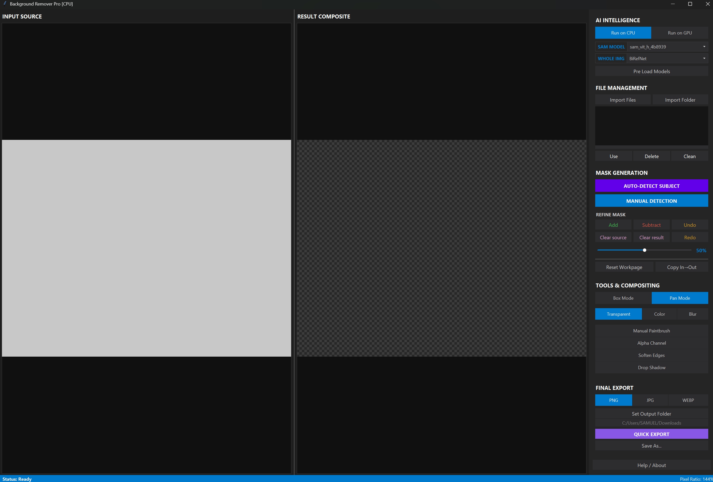

# BGRemover

A local background removal tool. This is a fork of the original project by pricklygorse, developed by Alfadoc.

This application provides an interface for removing backgrounds from images using ONNX models. It runs offline and supports whole-image extraction and interactive manual segmentation.

## Features

- **Interactive AI Support**: Utilise Segment Anything models like MobileSAM or ViT-H for precise object selection using point clicks or bounding boxes.
- **Automated AI Support**: Automate background removal using integrated whole-image models like BiRefNet, RMBG-1.4, U2Net, and IS-Net.
- **Hardware Acceleration**: A Toggle to switch between CPU and GPU processing.
- **Viewport Navigation**: Zoom and Pan controls.
- **Manual Paintbrush**: Refine masks manually using a toggleable paintbrush tool with adjustable size.
- **Mask Compositing**: Add to or Subtract from the current mask, with Undo/Redo history.
- **Edge Refinement**: Gaussian blur to the mask boundaries for natural blending.
- **Alpha Channel**: A raw alpha channel view, can be used to inspect the mask for imperfections before exporting, or be exported itself.
- **Drop Shadow**: A drop shadow effect with controls for opacity, blur radius, and X/Y offsets.
- **Background**: Replace backgrounds with transparency, a solid custom color or Blur.
- **File Gallery**: Manage multiple imported images via a visual thumbnail strip, allowing you to load, delete, or clear files from the workspace.
- **Import**: Files and Folders can be imported via Explorer selection or via dragging files or folders directly into the application window.
- **Export Formats**: Save processed images as PNG, JPG or WEBP.
- **Quick Export**: Instantly save the current result to a configured output folder.
- **User Interface**: Dark Carbon theme.




## Installation

### Prerequisites

- Python 3.x
- Required Python packages: `onnxruntime-directml==1.16.0`, `opencv-python`, `numpy==1.26.4`, `pillow`, `tkinterdnd2`

Install the required libraries using the following command:
```bash
pip install onnxruntime-directml==1.16.0 opencv-python pillow tkinterdnd2 numpy==1.26.4
```

Or download prebuilt executables for Windows, Linux and Mac from the [Github releases](link) 


## Model Downloads

This application requires pre-trained background removal/segmentation models in onnx format to function correctly. Please download the necessary models and place them in the Models/ directory. The script checks for models at each start up. 

**Interactive Models**
- Segment Anything + mobile-sam: [https://huggingface.co/vietanhdev/segment-anything-onnx-models/tree/main](https://huggingface.co/vietanhdev/segment-anything-onnx-models/tree/main)

   In the mobile_sam download, rename sam_vit_h_4b8939.decoder.onnx to mobile_sam.decoder.onnx, so there is a matching .encoder and .decoder. 

I recommend just using mobile-sam as it has near instant inference results, and you can zoom into the image for higher resolution masks. I haven't found much benefit to using the larger models.

If using quantised Segment Anything models, these require the .quant suffix before .encoder in the filename, which is the opposite of how they are named when downloaded from the links above.

**Whole Image Models**
- rembg: [https://huggingface.co/briaai/RMBG-1.4/tree/main/onnx](https://huggingface.co/briaai/RMBG-1.4/tree/main/onnx)

   - Please rename model.onnx to rmbg1_4.onnx

- u2net, disnet, BiRefNet, Segment Anything, and more: [https://github.com/danielgatis/rembg/releases/tag/v0.0.0](https://github.com/danielgatis/rembg/releases/tag/v0.0.0)
- rmbg2: [https://huggingface.co/briaai/RMBG-2.0/tree/main/onnx](https://huggingface.co/briaai/RMBG-2.0/tree/main/onnx)
   - Please rename model.onnx to rmbg2.onnx, or the quantised versions to rmbg2_q4.onnx etc

```python
# partial string match so will also match quantised versions e.g. rmbg2_quant_q4
sam_models = [
            "mobile_sam",
            "sam_vit_b_01ec64", 
            "sam_vit_h_4b8939",
            "sam_vit_l_0b3195",
            ]

whole_models = [
        "rmbg1_4",
        "rmbg2",
        "isnet-general-use",
        "isnet-anime",
        "u2net",
        "u2net_human_seg",
        "BiRefNet", # matches all birefnet variations
]
```

## Usage

### Launching the Application

Directly un the executable: [Github releases](https://github.com/SamuelRicci-138/BGRemover/releases/tag/v1.0.0) 

Or run the script from the command line:

```bash
python BGRemover.py
```


### Interface Overview

- **Input Canvas**: Displays the original image.
- **Output Canvas**: Displays the processed image with the background removed.
- **Controls Panel**: Contains various tools and options for interacting with the image and models.


### Basic Workflow

1.  **Select Hardware & Model**: 
    - **Hardware**: Toggle between "Run on CPU" or "Run on GPU" for your hardware preference.
    - **Models**: Choose the models from the "SAM MODEL" and "WHOLE IMG" dropdowns.
2.  **Load Images**: 
    - **Import**: Click "Import Files" to select specific images or "Import Folder" to load an entire directory. You can also Drag & Drop files directly onto the window.
    - **Gallery**: Loaded images appear in the gallery. Click a thumbnail to select it, then click "Use" to load it into the workspace.

3.  **Navigation**: 
    - **Controls Panel**: Use the mouse scroll wheel to scroll up and down the Panel, or use the lateral scrollbar.
    - **Zoom**: Use the mouse scroll wheel to zoom in and out bothe Input and Output relative to the cursor.
    - **Pan**: Right-click and drag to move the image view. Alternatively, toggle "Pan Mode" Off.

4.  **Generate Masks**:
    - **Auto-Detect Subject**: Click "AUTO-DETECT SUBJECT" to let the AI automatically identify and mask the main subject.
    - **Manual Detection**: Click "MANUAL DETECTION" to activate interactive mode:
        - **Green Point**: Left-click on areas you want to keep.
        - **Red Point**: Right-click on areas you want to exclude.
        - **Box Selection**: Toggle "Box Mode" On to use this feature. Left-click and drag to draw a box around the object, SAM will analize for a subject in it.

5.  **Refine & Combine**:
    - **Apply Mask**: The AI creates a blue preview overlay. Click "Add" to commit this overlay to your final result, or "Subtract" to remove it.
    - **Manual Paintbrush**: Toggle the paintbrush tool. Draw on the image to create a manual selection, then click "Add" or "Subtract" to apply it.
    - **History**: Use "Undo" and "Redo" to step backward or forward through your masking changes.

6.  **Compositing Tools**:
    - **Background**: Choose between "Transparent", "Plain color" or "Blur".
    - **Effects**: Toggle "Drop Shadow" to add a customizable shadow (opacity, blur, x/y offset). Toggle "Soften Edges" to smooth the mask boundaries.
    - **Alpha Channel**: Toggle "Alpha Channel" to view the Black&white mask, can be used to search for imperfections or be exported itself.

7.  **Export**: 
    - **Format**: Select your desired output format (PNG, JPG, or WEBP).
    - **Save**: Click "Quick Export" to instantly save to your output folder, or "Save As..." for a custom dialog.

### Keyboard Shortcuts

| Key | Action |
| :--- | :--- |
| **A** | Add Mask |
| **S** | Subtract Mask |
| **D** | Copy Source (Reset) |
| **W** | Clear Output |
| **R** | Reset All |
| **C** | Clear SAM Points |
| **P** | Toggle Paint |
| **V** | Erase Visible Area |
| **Ctrl + S** | Save As... |
| **Alt + Q** | Quick Export |


## Troubleshooting

- **No models found**: Ensure that the required models are downloaded and placed in the `Models/` directory.
- **Performance issues**: Zooming out can be laggy, especially with multiple scroll wheel clicks and multiple effects applied such as blurred background and drop shadow, GPU may not work propelly.


# Acknowledgements

This is a fork of pricklygorse's project [Interactive Image Background Remover](https://github.com/pricklygorse/Interactive-Image-Background-Remover).

You can support him [here](https://ko-fi.com/pricklygorse)
